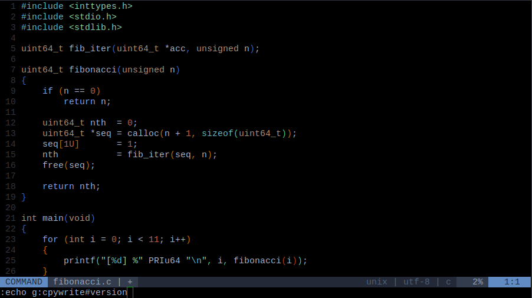

# vim-cpywrite

[![Build Status][travis-badge]][travis-builds]

---
### This branch is for development purposes
#### End users are advised to checkout a [release][] package
---

Generate copyright headers for any open source license



## Description

Mostly written in CPython, this (neo)vim plugin fetches the license of your choice directly from the [SPDX License List](https://github.com/spdx/license-list-xml).
If the XML response contains a standard header, it's inserted at the top of the current buffer with your copyright info.

When no standard header is provided, you can either insert a brief license acknowledgement, or the full license text. (See the `g:cpywrite#verbatim_mode` option [below](#options).)

This plugin learns your name and email by invoking `git`. If that fails, the copyright line will contain your OS user and host names.


## Highlights

- Python bindings compatible with python 2.7.x or 3.4+, depending on your platform and (neo)vim version, of course
- Choose from 380 licenses (press `<tab>` after the `:CPYwriteDefaultLicense` or `:CPYwrite` command for suggestions)
- No dependency on other plugins. That said, neovim users will be grateful to have the [completeopt](https://neovim.io/doc/user/options.html#'completeopt') feature when tabbing through all the available licenses. Vim users may want to add `set wildmenu` to their `.vimrc` file


## Quick Reference

### Commands
|   |   |
|:--|:--|
|`:CPYwrite [{spdx_short_name}]`|Fetches the license identified by `spdx_short_name` (without quotes) -- uses the current value of `g:cpywrite#default_license` when no argument is given -- supports `<tab>` completion |
|`:CPYwriteDefaultLicense [{spdx_short_name}]`|Sets `g:cpywrite#default_license` to the option license identified by `spdx_short_name` (without quotes) -- prints the default licence id when called with no argument -- supports `<tab>` completion|
|`:CPYwriteToggleMode`|Switches `g:cpywrite#verbatim_mode` on or off|
|`:CPYwriteToggleFilename`|Switches `g:cpywrite#hide_filename` on or off|
|`<Plug>(cpywrite)`|Does the same as calling `:CPYwrite` with no argument|

### Default mappings
|   |   |
|:--|:--|
|`{Normal}LH`|Maps to `<Plug>(cpywrite)`|

### Options
|   |   |Default Value|
|:--|:--|:--:|
|`g:cpywrite#default_license`|The SPDX identifier of the license to be fetched by the `:CPYwrite` command.|`"GPL-3.0-or-later"`|
|`g:cpywrite#verbatim_mode`|When set to a non-zero value, the full license text will be requested -- only choose this when the license is no longer than 3-4 paragraphs (e.g. Unlicense, MIT, BSD 1- 2- 3-Clause, etc.)|`0`|
|`g:cpywrite#hide_filename`|When set to a non-zero value, excludes the name of the current buffer from the license header in all modes.|`0`|


## Requirements

* Vim compiled with any one of the *+python[3]* or *+python[3]/dyn* options. See if you're supported by entering `vim --version | grep +python` at your terminal, or start `vim` and enter the `:version` command

* Neovim with the [**pynvim**](https://github.com/neovim/pynvim) module in your `$PYTHONPATH`. Start `nvim` and enter `:help provider-python` for more information


## Installation

If [**requests**](https://pypi.org/project/requests/) and (optionally) **pynvim** are not already in your `$PYTHONPATH`, install them:

    pip install --user -U requests
    pip install --user -U pynvim

#### As a vim package

If you have vim 8+, you can directly copy the plugin source tree to your [native package directory][vim-8-pkg-docs]. Learn more by typing `:help packages` into your `vim` command prompt. You should also read about [DIY plugin management](https://shapeshed.com/vim-packages).

Users of older vim versions can simulate native package loading with [vim-pathogen](https://github.com/tpope/vim-pathogen#native-vim-package-management).

* Under `~/.vim` create the following directory tree: `pack/plugins/start`

> According to the [vim help topic][vim-8-pkg-docs] and [this tutorial][vim-pack-man], you can use any valid directory name in place of `plugins`,  but let's keep things simple!

* Clone the source: `git clone https://github.com/rdipardo/vim-cpywrite ~/.vim/pack/plugins/start/vim-cpywrite`

#### As a remote plugin

**Using [plug.vim](https://github.com/junegunn/vim-plug)**

Edit your `~/.vimrc`, `~/.vim/vimrc`, or `~/.config/nvim/init.vim`:

```vim
call plug#begin()
"or:
"call plug#begin('~/path/to/your/plugin/directory/')

Plug 'rdipardo/vim-cpywrite'

call plug#end()
```

**Using [Vundle](https://github.com/VundleVim/Vundle.vim)**

Install Vundle:

    git clone https://github.com/VundleVim/Vundle.vim.git ~/.vim/bundle/Vundle.vim

or

    git clone https://github.com/VundleVim/Vundle.vim.git ~/.config/nvim/bundle/Vundle.vim

Edit your `~/.vimrc`, `~/.vim/vimrc`, or `~/.config/nvim/init.vim`:

```vim
set rtp+=~/.vim/bundle/Vundle.vim
"or:
"set rtp+=~/.config/nvim/bundle/Vundle.vim

call vundle#begin()

Plugin 'rdipardo/vim-cpywrite'

call vundle#end()
```

## Projects like this one

* [vim-licenses][vim-lic-2.0], formerly [licenses][vim-lic-1.0]
* [vim-header][vim-hdr]
* [license-to-vim][lic2vim]
* [license loader][licl]


## TODO

- [ ] Provide a batch mode for licensing all tracked files in a working tree
- [ ] Provide the option to set user-defined authorship details
- [x] Expand the list of [supported programming languages][lang-list]


## Improve this README
Consider opening a PR with an updated [installation guide](#installation) if any of the following applies to you:

* installation fails
* installation succeeds with a plugin manager not mentioned here


## License

Distributed under the terms of the MIT license


[vim-hdr]: https://github.com/alpertuna/vim-header
[vim-lic-2.0]: https://github.com/antoyo/vim-licenses
[vim-lic-1.0]: https://github.com/vim-scripts/Licenses
[lic2vim]: https://www.vim.org/scripts/script.php?script_id=5349
[licl]: https://www.vim.org/scripts/script.php?script_id=4064
[vim-8-pkg-docs]: https://github.com/vim/vim/blob/03c3bd9fd094c1aede2e8fe3ad8fd25b9f033053/runtime/doc/repeat.txt#L515
[vim-pack-man]: https://shapeshed.com/vim-packages/#how-it-works
[lang-list]: rplugin/pythonx/cpywrite/generator.py#L273
[travis-badge]: https://travis-ci.com/rdipardo/vim-cpywrite.svg?token=yCqYFpeQtymaztY4Spav&branch=pre-release
[travis-builds]: https://travis-ci.com/rdipardo/vim-cpywrite
[release]: https://github.com/rdipardo/vim-cpywrite/releases

<!--
 vim:ft=markdown:et:tw=78:
-->
